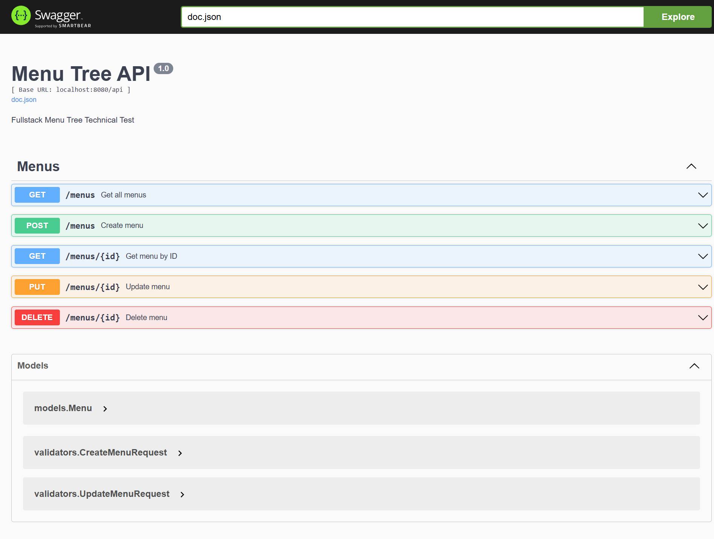

# Fullstack Menu Tree

Technical Test - Fullstack Menu Management System

## Features

### Backend

- REST API using Golang + Gin
- PostgreSQL Database
- GORM ORM
- Swagger Documentation
- Recursive Menu Tree API
- CRUD Menu Management

### Frontend

- React + TypeScript + Vite
- Tailwind CSS
- Recursive Tree View
- Search Menu
- Create Menu
- Update Menu
- Delete Menu
- Responsive Sidebar

---

## Tech Stack

### Backend

- Golang
- Gin
- GORM
- PostgreSQL
- Swagger

### Frontend

- React
- TypeScript
- Vite
- TailwindCSS
- Axios

---

## Project Structure

```text
fullstack-menu-tree
│
├── backend
│   ├── cmd
│   ├── config
│   ├── controllers
│   ├── docs
│   ├── models
│   ├── routes
│   └── services
│
├── frontend
│   ├── src
│   │   ├── components
│   │   ├── services
│   │   ├── pages
│   │   └── types
│
├── screenshots
│
└── README.md
```

---

## Environment Variables

Create `.env` file inside `backend` folder:

```env
DB_HOST=localhost
DB_PORT=5432
DB_USER=postgres
DB_PASSWORD=postgres
DB_NAME=menu_tree
DB_SSLMODE=disable
```

---

## API Endpoints

| Method | Endpoint       | Description    |
| ------ | -------------- | -------------- |
| GET    | /api/menus     | Get all menus  |
| GET    | /api/menus/:id | Get menu by id |
| POST   | /api/menus     | Create menu    |
| PUT    | /api/menus/:id | Update menu    |
| DELETE | /api/menus/:id | Delete menu    |

---

## Run Backend

```bash
cd backend

go mod tidy

go run ./cmd/main.go
```

Backend:

```text
http://localhost:8080
```

Swagger:

```text
http://localhost:8080/swagger/index.html
```

---

## Run Frontend

```bash
cd frontend

npm install

npm run dev
```

Frontend:

```text
http://localhost:5173
```

---

## Screenshots

### Dashboard


### Swagger API



---

## Author

Yuniar Nariswari
